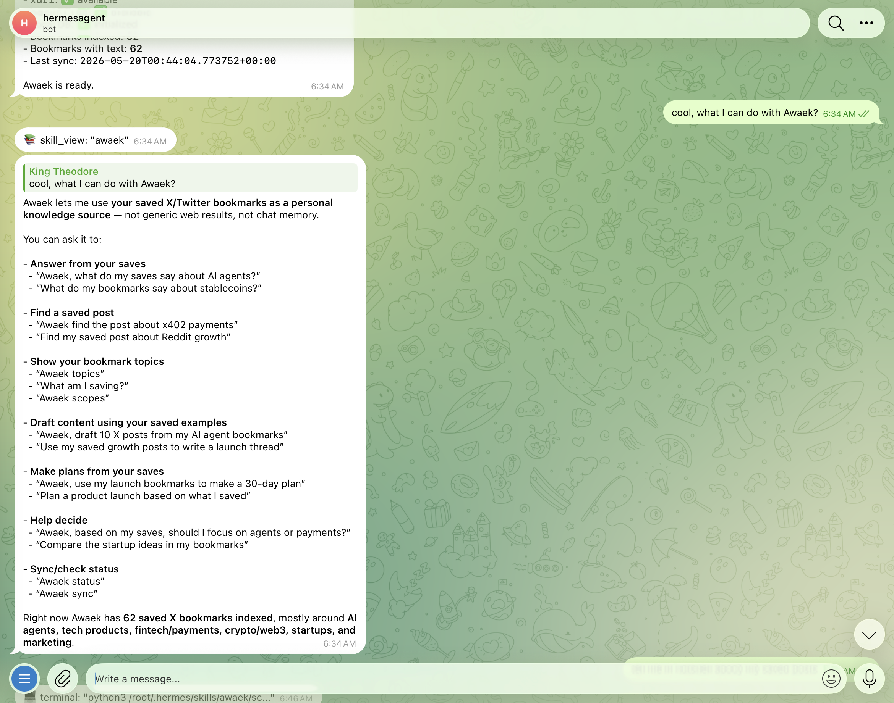
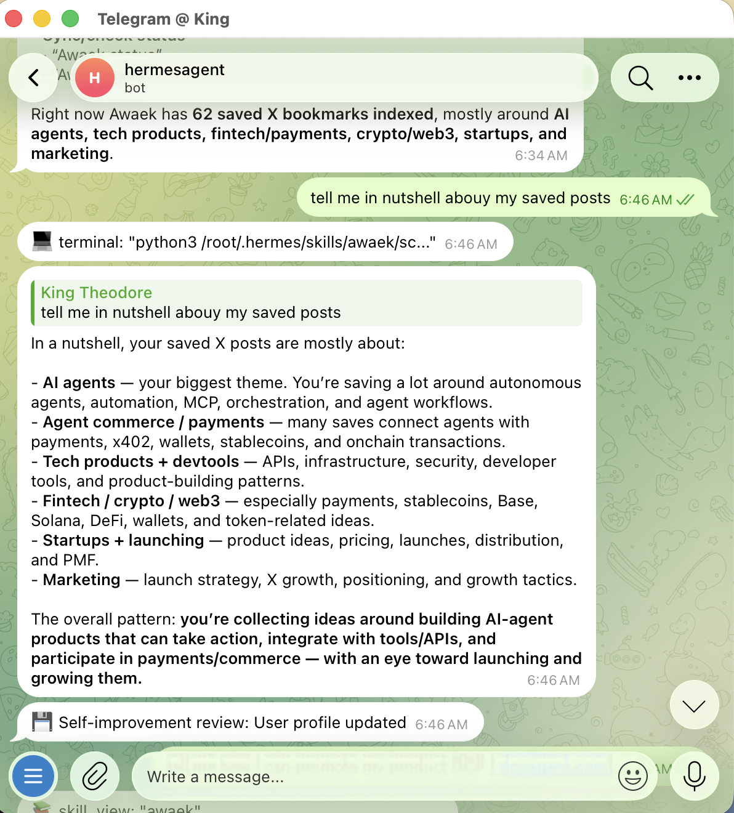

# Awaek

**Chat with your saved X bookmarks.**

Everyone saves good posts. Almost nobody uses them later. Awaek fixes that.

Awaek turns your saved X posts into a personal AI you can chat with — running locally inside your Hermes Agent. Ask questions, find old saves, draft content, compare ideas, or plan launches grounded in the links and posts you already curated.

No hosted backend. No pasted X secrets. Your bookmark library lives locally in SQLite.

```text
Awaek, what do my saves say about AI agents?
Awaek, find the post I saved about x402 payments.
Awaek, use my launch bookmarks to make a 30-day plan.
Awaek, draft 20 X posts from my saved growth posts.
```

## Demo

Ask Awaek what it can do with your saved posts:



Ask for a quick read on what your saved posts are mostly about:



## Why Awaek

Awaek gives your AI agent access to the ideas you already cared enough to save.

Use it to:

- answer questions from your own saved posts
- rediscover old bookmarks
- draft tweets, essays, and launch copy from your swipe file
- plan products, launches, and research from your curated examples
- understand what topics you keep saving
- build a private personal knowledge base from X

## What It Does

Awaek:

- answers questions using your saved posts as the source
- drafts tweets, threads, plans, and decisions grounded in your library
- surfaces old saves you forgot you had
- shows what topics you keep saving
- makes answers cite and follow your saved-post evidence

Under the hood, Awaek syncs via `xurl`, stores locally in SQLite, categorizes bookmarks, and builds evidence packs Hermes Agent can cite.

## Install

Ask Hermes:

```text
Install Awaek from 1lystore/awaek/skills/awaek and set it up for my saved X bookmarks.
```

You can send that in any Hermes chat: terminal, Telegram, Slack, Discord, or Open Web.

Or install from terminal:

```bash
hermes skills install 1lystore/awaek/skills/awaek
```

Restart Hermes or run:

```text
/reset
```

Then ask:

```text
Awaek status
```

If no bookmarks are indexed yet, Awaek will tell you to run:

```text
Awaek sync
```

## Requirements

- Hermes Agent
- Python 3
- `xurl` authenticated with an X account that can read bookmarks

`xurl` is the X API CLI used by Hermes to read and write X through the official API. The setup flow is covered here:

https://x.com/XDevelopers/status/2056871280599847054

Install `xurl`:

```bash
curl -fsSL https://raw.githubusercontent.com/xdevplatform/xurl/main/install.sh | bash
```

Check X authentication:

```bash
xurl auth status
xurl whoami
```

## Sync Bookmarks

In Hermes, ask:

```text
Awaek sync
```

On sync, Awaek fetches up to 100 recent saved X bookmarks in the current version, stores them in SQLite, categorizes them, and builds the local search index.

Then try:

```text
Awaek, what do my saves say about marketing?
Awaek, show my bookmark topics.
Awaek, find my saved posts about pricing.
```

## Privacy

Awaek is local-first. It stores your bookmark library locally.

- Bookmark data is stored at `~/.hermes/awaek/data/awaek.db`
- No hosted backend
- No cloud database
- No pasted X secrets
- X auth stays with `xurl`

## Roadmap

- Better topic learning from saved posts
- Smarter evidence packing for large bookmark libraries
- Sample mode for trying Awaek without X setup
- More saved-source connectors beyond X
- Richer writing and style workflows
